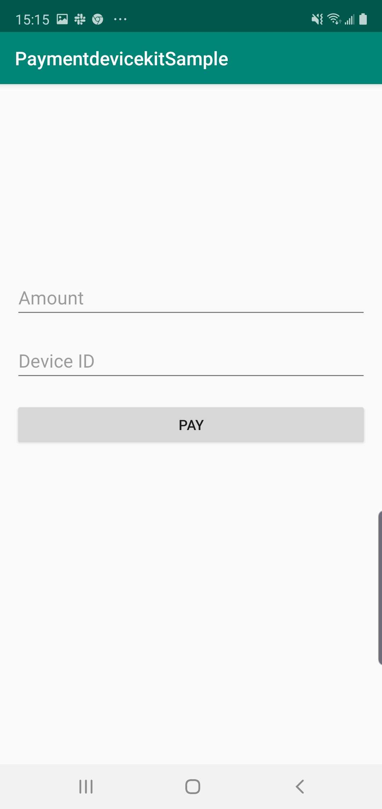

# SecuXPaymentDeviceKit Sample

Shows a simple APP using the secux-paymentdevicekit.aar

## Screenshot

<p float="center">

</p>

## SecuXPaymentDeviceKit Usage

### Add dependency secux-paymentdevicekit.aar

Copy the secux-paymentdevicekit.aar to ~/app/libs

Add dependency
```java
implementation fileTree(dir: 'libs', include: ['*.aar'])
```

### Add bluetooth privacy permissions

Add permission to the AndroidManifest.xml

    <uses-permission android:name="android.permission.BLUETOOTH"/>
    <uses-permission android:name="android.permission.BLUETOOTH_ADMIN"/>
    <uses-permission android:name="android.permission.INTERNET"/>
    <uses-permission android:name="android.permission.ACCESS_COARSE_LOCATION"/>
    <uses-permission android:name="android.permission.ACCESS_FINE_LOCATION"/>

Request permission

```java
    if (Build.VERSION.SDK_INT >= Build.VERSION_CODES.M) {
        if (this.checkSelfPermission(Manifest.permission.ACCESS_FINE_LOCATION) != PackageManager.PERMISSION_GRANTED) {
            requestPermissions(new String[]{Manifest.permission.ACCESS_FINE_LOCATION}, 1);
        }
    }
```

### Import the the module

```java 
import com.secuxtech.paymentdevicekit.*;
import static com.secuxtech.paymentdevicekit.PaymentPeripheralManager.SecuX_Peripheral_Operation_OK;
```

### Get ivKey

Pair<Integer, String> doGetIVKey(Context context, int scanTimeout, String connectDeviceId, int checkRSSI, final int connectionTimeout) 

Error message:

* Can't find device
* Connect with device timeout
* Receive data timeout
* Device is not activated
* Invalid peripheral ivkey

```java
PaymentPeripheralManager peripheralManager = new PaymentPeripheralManager();
Pair<Integer, String> getIVKeyret = peripheralManager.doGetIVKey(mContext, 5, devID, -80, 15);
String ivKey = "";
if (getIVKeyret.first == SecuX_Peripheral_Operation_OK) {
    ivKey = getIVKeyret.second;
    Log.i(TAG, "ivKey=" + ivKey);
} else {
    Log.i(TAG, "Get ivKey failed");
}
```
### Do payment

Pair<Integer, String>  doPaymentVerification(byte[] encryptedTransactionData, MachineIoControlParam machineControlParam) 

Error message:

* Invalid transaction data
* Receive response from device timeout
* Invalid payment amount response from device
* Set payment io configuration failed

```java
Pair<Integer, String> ret = peripheralManager.doPaymentVerification(encryptedData, machineIoControlParam);
if (ret.first != SecuX_Peripheral_Operation_OK) {
    Log.i(TAG, "Payment failed! " + ret.second);
} else {
    Log.i(TAG, "Payment done");
}
```

## Author

SecuX, maochunsun@secuxtech.com

## License

SecuXPaymentKit is available under the MIT license. See the LICENSE file for more info.
